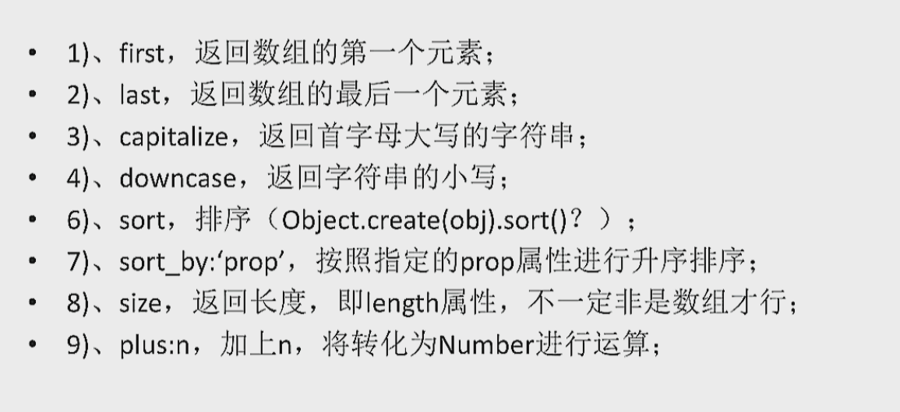

1、EJS是一个简单高效的模板语言，通过数据和模板，可以生成HTML标记文本。可以说EJS是一个JavaScript库，EJS可以同时运行在客户端和服务器端，客户端安装直接引入文件即可，服务器端用npm包安装

2、EJS的特点：

* 快速编译和渲染
* 简单的模板标签
* 自定义标记分隔符
* 支持文本包含
* 支持浏览器端和服务器端
* 模板静态缓存
* 支持express视图系统

3、EJS成员函数：

* Render(str,data,[option]):直接渲染字符串并生成html<br>
str：需要解析的字符串模板<br>
data：数据<br>
option：配置选项<br>

* Compile(str,[option]):编译字符串得到模板函数<br>
str：需要解析的字符串模板<br>
option：配置选项<br>

两个函数包括的配置选项如下：


4、EJS常用标签

* <% %>流程控制标签
* <%= %>输出标签（原文输出HTML标签）
* <%- %>输出标签（HTML会被浏览器解析）
* <%# %>注释标签
* % 对标记进行转义
* -%>去掉没用的空格

  说明：ejs中的逻辑代码全部用JavaScript
  
5、接下来看一个例子就可以明白EJS的简单语法了

```ejs
<!DOCTYPE html>
<html>
<head>
<meta charset="utf-8">
<meta http-equiv="X-UA-Compatible" content="IE=edge,chrome=1">
<title>EJS Examples</title>
<meta name="description" content="">
<meta name="keywords" content="">
<link href="" rel="stylesheet">
<script type="text/javascript" src="ejs.min.js"></script>
<script >
    var data={flag:false,
                   data1:["====1","====2","====3"],
                   data2:["====4","====5","====6"]
               };

    window.onload=function(){
        var tem=document.getElementById("tem").innerHTML;
        var html=ejs.render(tem,data);
        document.getElementsByTagName("body")[0].innerHTML=html;
    }
</script>
</head>
<body>
<script type="text/javascript" id="tem">
<ul>
    <%if(flag){%>
      <%for (var i=0;i<data1.length;i++){%>
      <li><%=data1[i]%></li>
      <%}%>
      <%}else{%>
          <%for(var i=0;i<data2.length;i++){%>
          <li><%=data2[i]%></li>
          <%}%>
          <%}%>
      </ul>
</script>
</body>
</html>
```
运行后结果如下：
* ====4
* ====5
* ====6

4、过滤器（把结果进一步加工的函数）：



语法如下：

    <%=: data.age | plus:5%>

  注意:和|两个符号:<br>
此外，还有文件包含的语法：

    <%- include(path) %>

参考文章[地址](http://www.jianshu.com/p/67dda091fc68)